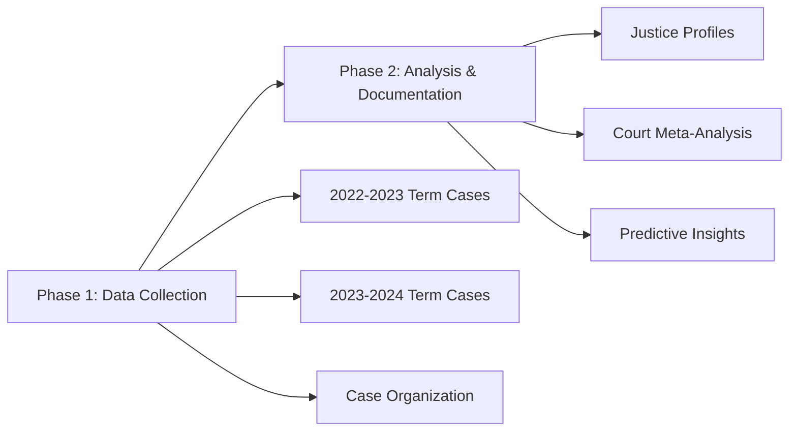
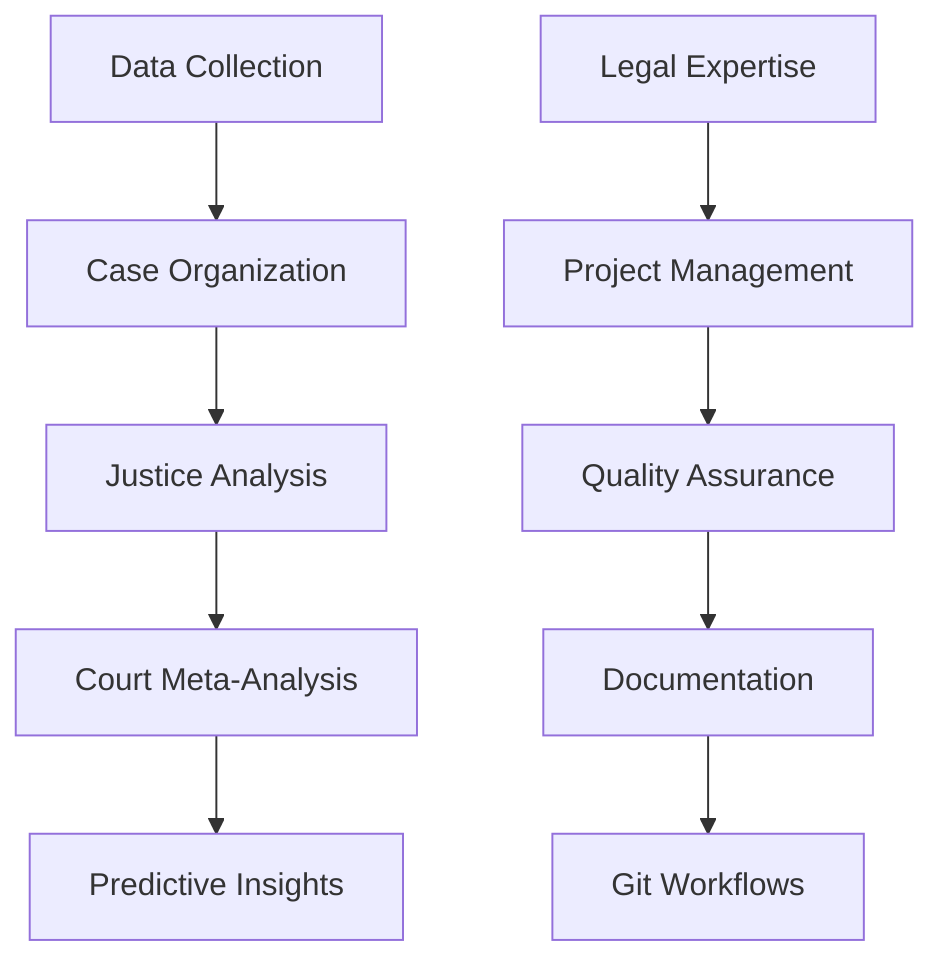

# ClaudeScotus

  

**Supreme Court Analysis System**

Streamlined AI system for Supreme Court decision analysis and judicial pattern recognition.

## 📋 Table of Contents

<details>
<summary>Project Overview</summary>

- [Overview](#overview)
- [Current Status](#current-status)
- [Architecture](#architecture)
- [Getting Started](#getting-started)

</details>

<details>
<summary>Project Structure</summary>

- [Phase Structure](#phase-structure)
- [Data Organization](#data-organization)
- [Analysis Framework](#analysis-framework)

</details>

<details>
<summary>Quick Reference</summary>

- [Quick Reference](#quick-reference)

</details>

## Overview

| Metric | Value | Status |
|--------|-------|--------|
| **Goal** | Analyze Supreme Court decisions and judicial patterns | 🎯 Active |
| **Method** | Legal analysis with project management discipline | ✅ Streamlined |
| **Current Phase** | Phase 1 - Data Collection | 🔄 In Progress |
| **Role** | Legal Analysis & Project Management Specialist | ⚙️ Unified |

> **🎯 Core Mission**  
> Collect, organize, and analyze Supreme Court decisions to understand judicial patterns and decision-making processes.

## Current Status



| Phase | Status | Description |
|-------|--------|-------------|
| **Phase 1: Data Collection** | 🔄 In Progress | Collect case files for last two Supreme Court terms |
| **Phase 2: Analysis & Documentation** | ⏸️ Planned | Create justice profiles and court meta-analysis |

**Current Priority**: Complete data collection for 2022-2023 and 2023-2024 terms

## Phase Structure

### Phase 1: Data Collection
- **Objective**: Collect and organize Supreme Court case materials for the last two terms
- **Scope**: 2022-2023 and 2023-2024 Supreme Court terms
- **Deliverables**: 
  - Complete case files with briefs, opinions, and oral arguments
  - Standardized case folder structure
  - Term summary documents
  - Searchable metadata system

### Phase 2: Analysis & Documentation
- **Objective**: Create comprehensive justice profiles and court meta-analysis
- **Scope**: All 9 current Supreme Court justices plus court dynamics
- **Deliverables**:
  - Individual justice behavioral profiles
  - Court coalition and alignment analysis
  - Predictive framework for future decisions
  - Meta-analysis of court ideological trends

## Data Organization

### Case Structure
```
data/terms/[YEAR]/cases/[case-name]/
├── metadata.json           # Case identifiers and key information
├── briefs/                # Petitioner and respondent briefs
├── opinions/              # Majority, concurring, dissenting opinions
├── oral_arguments/        # Transcripts and audio files
└── README.md              # Case overview and analysis
```

### Justice Profiles
```
data/analysis/justices/[justice-name].md
├── Voting Patterns        # Historical voting behavior
├── Judicial Philosophy    # Constitutional interpretation approach
├── Key Opinions          # Significant majority/dissenting opinions
├── Coalition Behavior    # Alignment with other justices
└── Prediction Factors    # Key indicators for future votes
```

## Architecture

### System Design



| Component | Description | Benefits |
|-----------|-------------|----------|
| **Unified Role** | Single role combining legal, PM, and prompt engineering | Streamlined workflow, reduced complexity |
| **File-based System** | No databases required | Simple, version-controlled, transparent |
| **Git Workflows** | Version control for all analysis | Audit trail, collaboration, recovery |
| **Structured Documentation** | Consistent formats and standards | Searchable, reproducible, professional |

## Analysis Framework

### Data Sources
- **Primary**: Supreme Court official website, CourtListener API
- **Secondary**: Legal databases, oral argument transcripts
- **Quality**: Official sources only, complete case records

### Methodology
1. **Systematic Collection**: Comprehensive case file gathering
2. **Standardized Organization**: Consistent folder structure and metadata
3. **Pattern Analysis**: Justice voting behavior and reasoning patterns
4. **Coalition Mapping**: Inter-justice alignment and influence
5. **Predictive Modeling**: Framework for future case analysis

### Quality Standards
- [ ] **Complete Case Records** - All briefs, opinions, oral arguments
- [ ] **Consistent Metadata** - Standardized case information
- [ ] **Searchable Documentation** - Clear organization and indexing
- [ ] **Professional Analysis** - Legal accuracy and thoroughness
- [ ] **Reproducible Methods** - Documented processes and decisions

## Getting Started

1. **Check Role Configuration** - Review `CLAUDE.md` for current role setup
2. **Understand Architecture** - Read `ARCHITECTURE.md` for project structure
3. **Begin Phase 1** - Start with data collection for target terms

**Current Focus**: Data collection for 2022-2023 and 2023-2024 Supreme Court terms

## Quick Reference

**Project Structure** → See `ARCHITECTURE.md`  
**Role Configuration** → See `CLAUDE.md`  
**Data Organization** → `data/terms/[YEAR]/cases/`  
**Analysis Output** → `data/analysis/justices/` and `data/analysis/court-meta/`