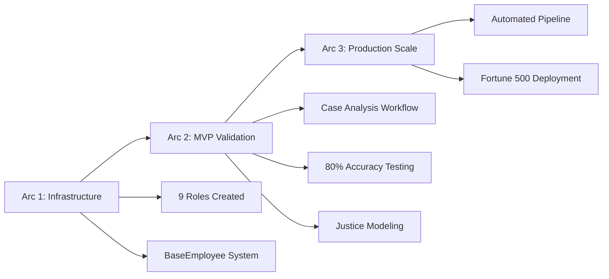
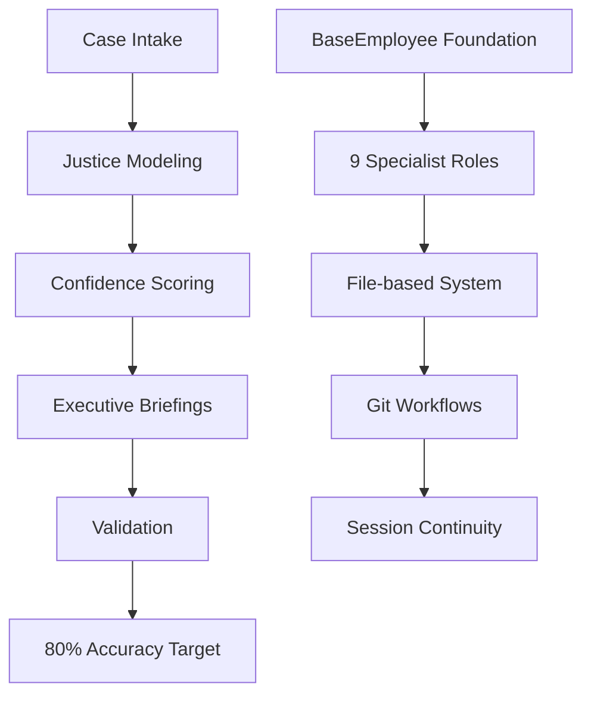

# ClaudeScotus

  

**Supreme Court Prediction System**

Experimental AI system for Supreme Court decision prediction using role-based analysis.

## 📋 Table of Contents

Project Overview

- [Overview](#overview)
- [Current Status](#current-status)
- [Success Metrics](#success-metrics)
- [Roadmap](#roadmap)

System Architecture

- [Role System](#role-system)
- [Architecture](#architecture)
- [Getting Started](#getting-started)
- [Session Management](#session-management)

Quick Reference

- [Quick Reference](#quick-reference)

## Overview

| Metric | Value | Status |
|--------|-------|--------|
| **Goal** | 80% prediction accuracy for Supreme Court decisions | 🎯 Target |
| **Method** | Role-based AI analysis system | ✅ Active |
| **Target** | Fortune 500 legal teams | 🏆 Client Focus |
| **Default Role** | Product Manager (auto-loads) | ⚙️ Default |

> **🎯 Core Mission**  
> Transform Supreme Court decision prediction from educated guesswork to data-driven intelligence for Fortune 500 legal strategy.

## Current Status

| Phase | Status | Description |
|-------|--------|-------------|
| **Arc 1: Infrastructure** | ✅ Complete | 9 specialized roles with BaseEmployee inheritance |
| **Arc 2: MVP Validation** | 🟡 Active | Testing case analysis workflow |
| **Arc 3: Production Scale** | ⏸️ Planned | Automated pipeline for Fortune 500 deployment |

**Current Priority**: Achieve 80% prediction accuracy target

## Role System

### Role Categories

Legal Expertise

| Role | Function | Status |
|------|----------|--------|
| **Supreme Court Specialist** | Case analysis, precedent research | ✅ Active |
| **Law Partner** | Strategic decisions, client briefings | ✅ Active |

Technical Team

| Role | Function | Status |
|------|----------|--------|
| **System Architect** | Technical foundation, system design | ✅ Active |
| **Staff Engineer** | Code quality, technical leadership | ✅ Active |
| **Full-Stack Engineer** | Implementation, feature development | ✅ Active |

Data & Management

| Role | Function | Status |
|------|----------|--------|
| **Data Specialist** | CourtListener API, data processing | ✅ Active |
| **Product Manager** | Project orchestration (default) | ✅ Default |
| **Finance Controller** | Budget management, efficiency | ✅ Active |
| **Role Designer** | Maya Chen - System evolution | ✅ Active |

> **📝 Role Guide**  
> See `corporate policy/role-reference-guide.md` for detailed consultation patterns and usage guidelines.

## Architecture

### System Design

| Component | Description | Benefits |
|-----------|-------------|----------|
| **File-based System** | No databases required | Simple, version-controlled, transparent |
| **Role Inheritance** | 9 specialists with BaseEmployee foundation | Consistent protocols, specialized expertise |
| **Git Workflows** | Version control for all analysis | Audit trail, collaboration, recovery |
| **Session Continuity** | Memory system across sessions | Context preservation, incremental improvement |

## Success Metrics

### Primary KPIs

| Metric | Target | Current | Validation Method |
|--------|--------|---------|-------------------|
| **Prediction Accuracy** | 80% | Testing | Historical case validation |
| **Confidence Calibration** | Well-calibrated | In development | Accuracy vs confidence correlation |
| **Fortune 500 Utility** | High | In validation | Client feedback, decision impact |
| **Professional Quality** | Partner-level | Target | Law firm review standards |

### Quality Standards

- [ ] **80% prediction accuracy** with confidence calibration
- [ ] **Fortune 500 utility** - actionable corporate legal intelligence
- [ ] **Professional quality** - Law firm partner-level analysis
- [ ] **Audit trail** - Complete decision reasoning
- [ ] **Confidence scoring** - Uncertainty quantification
- [ ] **Strategic guidance** - Executive decision support

## Getting Started

1. **Product Manager auto-loads** - Check `CLAUDE.md` for startup routine
2. **Review role guide** - `corporate policy/role-reference-guide.md`
3. **Check recent sessions** - `claude sessions/` for context

**Case Analysis**: Supreme Court Specialist → Law Partner → Executive deliverables

## Roadmap

**Arc 1**: Infrastructure ✅ Complete - 9 roles, BaseEmployee system  
**Arc 2**: MVP Validation 🎯 Active - 80% accuracy testing  
**Arc 3**: Production Scale 📋 Planned - Automated pipeline

## Session Management

**Wind-down**: Use `WIND_DOWN` macro → save to `claude sessions/`  
**Resume**: Check last wind-down + open issues + role memories

## Quick Reference

**Case analysis** → Supreme Court Specialist  
**Strategic decisions** → Law Partner + Finance Controller  
**Technical work** → System Architect + Staff Engineer  
**Role help** → `corporate policy/role-reference-guide.md`