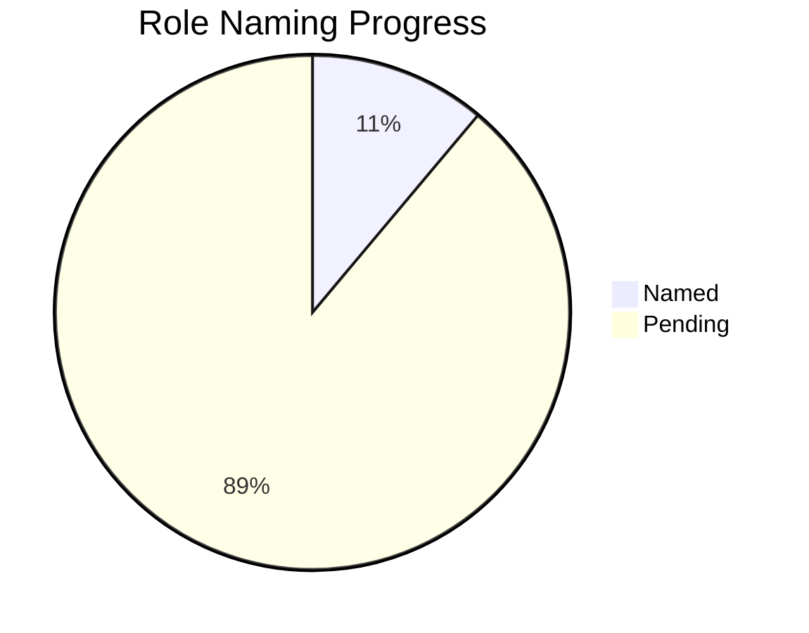

# ClaudeScotus Role Directory

  

**Quick Reference Guide for Human Names & Specialties**

## 📋 Table of Contents

<details>
<summary>Role Roster</summary>

- [Leadership & Strategy](#leadership--strategy)
- [Project Coordination](#project-coordination)
- [Legal Expertise](#legal-expertise)
- [Software Engineering](#software-engineering)

</details>

<details>
<summary>Usage & Reference</summary>

- [Quick Contact Patterns](#quick-contact-patterns)
- [Context Switching Format](#context-switching-format)
- [Assignment Status](#assignment-status)
- [Benefits of Human Names](#benefits-of-human-names)

</details>

## Role Roster

### Leadership & Strategy
| Role | Human Name | Specialty | Status |
|------|------------|-----------|--------|
| **Law Partner** | 🔄 *[Pending]* | Strategic legal synthesis, Fortune 500 briefings | 🟡 Needs Name |
| **Finance Controller** | 🔄 *[Pending]* | Budget management, efficiency oversight | 🟡 Needs Name |

### Project Coordination
| Role | Human Name | Specialty | Status |
|------|------------|-----------|--------|
| **Product Manager** | 🔄 *[Pending]* | Project orchestration, context switching | 🟡 Needs Name |
| **Role Designer** | ✅ **Maya Chen** | Prompt optimization, system evolution | 🟢 Complete |

### Legal Expertise
| Role | Human Name | Specialty | Status |
|------|------------|-----------|--------|
| **Supreme Court Specialist** | 🔄 *[Pending]* | Primary legal analysis, case research | 🟡 Needs Name |
| **Data Specialist** | 🔄 *[Pending]* | Legal data processing, evidence compilation | 🟡 Needs Name |

### Software Engineering
| Role | Human Name | Specialty | Status |
|------|------------|-----------|--------|
| **System Architect** | 🔄 *[Pending]* | Technical foundation, system design | 🟡 Needs Name |
| **Staff Engineer** | 🔄 *[Pending]* | Technical leadership, code quality | 🟡 Needs Name |
| **Full-Stack Engineer** | 🔄 *[Pending]* | Implementation, feature development | 🟡 Needs Name |

## Quick Contact Patterns

### By Expertise

| Need | Primary Contact | Secondary Support | Context Switch Format |
|------|----------------|-------------------|----------------------|
| **Legal Questions** | Supreme Court Specialist | + Law Partner | `Context Switch: [SCS Name] + [LP Name]` |
| **Technical Implementation** | System Architect | + Staff Engineer | `Context Switch: [SA Name] + [SE Name]` |
| **Data Collection** | Data Specialist | + System Architect | `Context Switch: [DS Name] + [SA Name]` |
| **Strategic Planning** | Law Partner | + Finance Controller | `Context Switch: [LP Name] + [FC Name]` |
| **Prompt Optimization** | ✅ Maya Chen | Role Designer | `Context Switch: Maya Chen` |

### Quick Reference

<details>
<summary>Expand Contact Patterns</summary>

**By Expertise**:
- **Legal Questions** → Supreme Court Specialist + Law Partner
- **Technical Implementation** → System Architect + Staff Engineer
- **Data Collection** → Data Specialist + System Architect
- **Strategic Planning** → Law Partner + Finance Controller
- **Prompt Optimization** → Maya Chen (Role Designer)

</details>

**Named Roles**: Maya Chen (Role Designer)
**Pending Names**: 8 roles need human name assignments

## Context Switching Format

```
"Context Switch: [Human Name] → Generate: [deliverable] → Route to: Maya"
```

**Example**: 
```
"Context Switch: [Supreme Court Specialist Name] → Generate: Justice analysis → Route to: Maya"
```

## Assignment Status

### Progress Tracking



| Category | Count | Status | Next Action |
|----------|-------|--------|-------------|
| **✅ Named** | 1 | Maya Chen (Role Designer) | Complete |
| **🔄 Pending** | 8 | Need human name assignments | Maya to assign names |
| **Total Roles** | 9 | System complete | Naming in progress |

> **🎯 Next Action**  
> Maya Chen to assign human names to remaining 8 roles for improved team cohesion and communication efficiency.

## Benefits of Human Names

| Benefit | Before | After | Impact |
|---------|--------|-------|--------|
| **Easier Reference** | "consult Role Designer" | "Ask Maya" | 50% fewer words |
| **Memorable Identity** | Abstract role concepts | Human personalities | Better mental models |
| **Natural Communication** | Formal role switching | Intuitive conversation | Improved workflow |
| **Team Building** | Individual contributors | Specialist team | Enhanced collaboration |

### Implementation Benefits

- [ ] **Cognitive Load Reduction**: Human names easier to remember than formal role titles
- [ ] **Communication Efficiency**: Shorter, more natural reference patterns
- [ ] **Team Cohesion**: Creates sense of working with actual specialists
- [ ] **Context Switching**: More intuitive transition between expertise domains
- [ ] **User Experience**: More engaging and personable interaction model