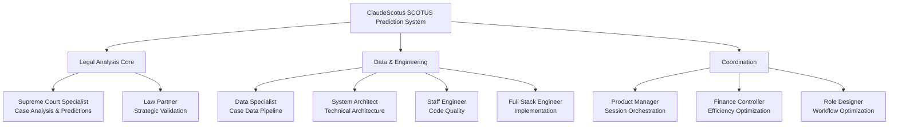

# ClaudeScotus Role Reference Guide

  

**Version**: 2.0  
**Purpose**: Quick reference for role selection and session coordination  
**Focus**: SCOTUS prediction development workflow

## 📋 Table of Contents

Organization & Structure

- [Organizational Structure](#organizational-structure)
- [Role Quick Reference](#role-quick-reference)
- [Role Selection for SCOTUS Prediction Work](#role-selection-for-scotus-prediction-work)

Session Management

- [Session Handoff Guidelines](#session-handoff-guidelines)
- [Session Anti-Patterns to Avoid](#session-anti-patterns-to-avoid)
- [Session Efficiency Optimization](#session-efficiency-optimization)

Performance & Optimization

- [Session Performance Indicators](#session-performance-indicators)
- [Quick Reference Cards](#quick-reference-cards)

  

---

## Organizational Structure

### Organizational Hierarchy

| Division | Roles | Primary Function |
|----------|-------|------------------|
| **Legal Analysis Core** | Supreme Court Specialist, Law Partner | SCOTUS case analysis and strategic validation |
| **Data & Engineering** | Data Specialist, System Architect, Staff Engineer, Full Stack Engineer | Technical implementation and data processing |
| **Coordination** | Product Manager, Finance Controller, Role Designer | Session management and optimization |

---

## Role Quick Reference

### 🏛️ Law Partner
**Purpose**: Validates SCOTUS prediction methodology and analysis quality  
**🟢 Activate When**: Strategic validation of predictions, legal analysis quality assurance  
**🔴 Avoid When**: Technical research, data processing, software implementation  
**Session Role**: Final validation of legal analysis accuracy and professional standards  

### 💰 Finance Controller  
**Purpose**: Claude Code session efficiency and prediction ROI optimization  
**🟢 Activate When**: Session performance analysis, workflow efficiency improvements  
**🔴 Avoid When**: Technical implementation, legal analysis, role creation  
**Session Role**: Session efficiency monitoring, workflow optimization, performance metrics  

### 📋 Product Manager
**Purpose**: SCOTUS prediction project coordination and session management  
**🟢 Activate When**: Session planning, issue tracking, role coordination, project guidance  
**🔴 Avoid When**: Deep technical architecture, detailed legal analysis, role design  
**Session Role**: Session orchestration, cross-role handoffs, issue tracking management  

### 🎭 Role Designer
**Purpose**: Role optimization and Claude Code workflow improvement  
**🟢 Activate When**: Role performance issues, session workflow optimization, context management  
**🔴 Avoid When**: Domain expertise needed (legal, technical), routine prediction work  
**Session Role**: Workflow optimization, role definition refinement, session efficiency improvement  

### ⚖️ Supreme Court Specialist
**Purpose**: Primary SCOTUS case analysis and judicial decision prediction  
**🟢 Activate When**: Case analysis, Justice behavior patterns, prediction methodology, legal research  
**🔴 Avoid When**: Technical implementation, project management, workflow coordination  
**Session Role**: Core prediction generation, legal analysis, accuracy validation  

### 📊 Data Specialist
**Purpose**: SCOTUS case data processing and analysis pipeline management  
**🟢 Activate When**: Case data processing, evidence compilation, analytical workflows, research support  
**🔴 Avoid When**: Strategic decisions, technical architecture, legal interpretation  
**Session Role**: Data quality assurance, analytical methodology, research process optimization  

### 🏗️ System Architect
**Purpose**: SCOTUS prediction system architecture and technical foundation  
**🟢 Activate When**: System architecture, integration planning, scalability decisions  
**🔴 Avoid When**: Day-to-day coding, legal analysis, session coordination  
**Session Role**: Technical architecture authority, system design validation, integration planning  

### 👨‍💼 Staff Engineer
**Purpose**: Code quality standards and technical implementation leadership  
**🟢 Activate When**: Code review, quality standards, technical optimization, performance improvements  
**🔴 Avoid When**: Architecture decisions, legal analysis, project planning  
**Session Role**: Technical quality assurance, implementation standards, code review  

### 💻 Full-Stack Engineer
**Purpose**: SCOTUS prediction system implementation and feature development  
**🟢 Activate When**: Coding, implementation, feature development, technical building  
**🔴 Avoid When**: Architecture decisions, legal analysis, strategic planning  
**Session Role**: Implementation execution, technical constraints, development progress  

---

## Role Selection for SCOTUS Prediction Work

| Need Category | Specific Requirement | Recommended Role | Secondary Support |
|---------------|---------------------|------------------|-------------------|
| **🎯 SCOTUS Analysis** | Case analysis & predictions | Supreme Court Specialist | Data Specialist |
| **🎯 SCOTUS Analysis** | Strategic validation | Law Partner | Supreme Court Specialist |
| **🎯 SCOTUS Analysis** | Case data processing | Data Specialist | System Architect |
| **🔧 Technical Work** | System architecture | System Architect | Staff Engineer |
| **🔧 Technical Work** | Code quality/standards | Staff Engineer | Full-Stack Engineer |
| **🔧 Technical Work** | Implementation/features | Full-Stack Engineer | Staff Engineer |
| **📈 Coordination** | Session management & issue tracking | Product Manager | Role Designer |
| **📈 Coordination** | Session efficiency optimization | Finance Controller | Product Manager |
| **📈 Coordination** | Role/workflow improvements | Role Designer | Product Manager |
| **💼 Optimization** | Prediction accuracy validation | Law Partner | Supreme Court Specialist |
| **💼 Optimization** | Session performance analysis | Finance Controller | Role Designer |
| **💼 Optimization** | Workflow and priority management | Product Manager | Finance Controller |

### Quick Selection Guide

🎯 Need SCOTUS analysis?

- **Case analysis & predictions** → Supreme Court Specialist
- **Strategic validation** → Law Partner  
- **Case data processing** → Data Specialist

🔧 Need technical work?

- **System architecture** → System Architect
- **Code quality/standards** → Staff Engineer
- **Implementation/features** → Full-Stack Engineer

📈 Need coordination?

- **Session management & issue tracking** → Product Manager
- **Session efficiency optimization** → Finance Controller
- **Role/workflow improvements** → Role Designer

💼 Need optimization?

- **Prediction accuracy validation** → Law Partner
- **Session performance analysis** → Finance Controller
- **Workflow and priority management** → Product Manager

---

## Session Handoff Guidelines

### 🟢 **Primary Session Patterns**
- **SCOTUS Analysis**: Supreme Court Specialist → Law Partner validation
- **Technical Implementation**: System Architect → Staff Engineer → Full-Stack Engineer
- **Data Processing**: Data Specialist → Supreme Court Specialist analysis
- **Session Coordination**: Product Manager orchestration with role-specific handoffs

### 🟡 **Secondary Coordination**
- **Finance Controller**: Session efficiency analysis and workflow optimization
- **Role Designer**: When session patterns need optimization or role improvements
- **Cross-validation**: Multiple Claude instances for critical prediction validation

### 🔴 **Avoid Session Mixing**
- **Technical roles**: In pure legal analysis sessions
- **Legal roles**: In pure technical implementation sessions
- **Coordination roles**: In domain-specific deep work sessions

---

## Session Anti-Patterns to Avoid

| Anti-Pattern Category | Specific Issues | Correct Approach | Impact |
|----------------------|----------------|------------------|--------|
| **❌ Wrong Role Activation** | Supreme Court Specialist for technical implementation | Use System Architect/Staff Engineer | Poor quality, wasted time |
| **❌ Wrong Role Activation** | Product Manager for detailed legal analysis | Use Supreme Court Specialist | Inaccurate analysis |
| **❌ Wrong Role Activation** | Finance Controller for case analysis or coding | Use appropriate domain expert | Ineffective session |
| **❌ Wrong Role Activation** | System Architect for routine implementation tasks | Use Full-Stack Engineer | Resource misallocation |
| **❌ Session Scope Confusion** | Mixing legal and technical in single session | Separate sessions by domain | Context confusion |
| **❌ Session Scope Confusion** | Wrong role expertise for task domain | Match expertise to need | Poor outcomes |
| **❌ Session Scope Confusion** | Comprehensive analysis when focused needed | Target specific expertise | Inefficient analysis |
| **❌ Session Scope Confusion** | Context switching without handoff documentation | Proper documentation | Lost context |
| **❌ Missing Validation** | SCOTUS predictions without Law Partner validation | Always validate with Law Partner | Accuracy risk |
| **❌ Missing Validation** | Technical architecture without System Architect review | System Architect validation | Technical debt |
| **❌ Missing Validation** | Session efficiency issues without Finance Controller | Finance Controller analysis | Continued inefficiency |
| **❌ Missing Validation** | Role performance without Role Designer consultation | Role Designer optimization | Ongoing problems |

### Critical Avoidance Checklist

- [ ] **Role-Task Alignment**: Correct role selected for task domain
- [ ] **Session Focus**: Single domain focus per session
- [ ] **Expertise Match**: Role expertise matches requirement
- [ ] **Validation Process**: Appropriate validation role involved
- [ ] **Handoff Documentation**: Context preserved between sessions
- [ ] **Domain Separation**: Legal and technical work properly separated

---

## Session Efficiency Optimization

### ⚡ **Start Focused**
1. **Select appropriate role** for primary task domain
2. **Use role memory triggers** for context loading
3. **Check `CURRENT-STATUS.md`** for session continuity
4. **Apply `/clear`** before major context switches

### ⚡ **Session Handoffs**
- **Update role memory** with key insights and decisions
- **Commit progress** with meaningful git messages
- **Update `CURRENT-STATUS.md`** with next session context
- **Reference issue tags** for traceability

### ⚡ **Context Management**
1. **Use role expertise** within defined scope
2. **Document handoff needs** in session wind-down
3. **Preserve context** in git commits and memory files
4. **Optimize for prediction accuracy** as primary success metric

---

## Session Performance Indicators

### 🚨 **Role Designer Consultation Needed**
- Session patterns consistently inefficient or unfocused
- Role boundaries unclear affecting prediction quality
- Workflow bottlenecks reducing session effectiveness
- Context management issues affecting role performance

### 🚨 **Law Partner Validation Required**
- SCOTUS prediction accuracy concerns
- Legal analysis quality issues
- Methodology validation for complex cases
- Strategic alignment of prediction approach

### 🚨 **Finance Controller Analysis Needed**
- Session efficiency declining or context overload frequent
- Workflow bottlenecks affecting prediction development
- Performance optimization opportunities identified
- Session pattern analysis for improvement opportunities

---

## Quick Reference Cards

### 📋 **Product Manager Session Focus**
Primary: Session coordination, issue tracking, role handoff management  
Handoff: Law Partner (validation), Finance Controller (efficiency), System Architect (technical)  
Avoid: Deep technical work, detailed legal analysis  

### ⚖️ **Supreme Court Specialist Session Focus**  
Primary: SCOTUS case analysis, judicial prediction, legal research  
Handoff: Law Partner (validation), Data Specialist (data processing)  
Avoid: Technical implementation, session coordination  

### 🏗️ **System Architect Session Focus**
Primary: Technical architecture, system design, integration planning  
Handoff: Staff Engineer (implementation), Product Manager (coordination)  
Avoid: Routine coding, legal analysis, session management  

---

**Focus**: SCOTUS prediction development with efficient Claude Code session management  
**Owners**: Role Designer (optimization) + Product Manager (coordination)  
**Context**: Supports 80% prediction accuracy target through focused role expertise