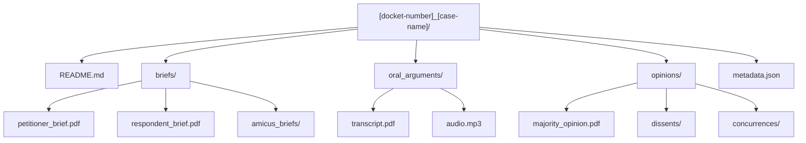

# Supreme Court Data Repository

  

## 📋 Table of Contents

<details>
<summary>Repository Structure</summary>

- [Terms](#terms)
- [Analysis](#analysis)
- [Case File Structure](#case-file-structure)

</details>

<details>
<summary>Usage & Navigation</summary>

- [Usage](#usage)
- [Data Quality Standards](#data-quality-standards)

</details>

## Repository Structure

### Terms

| Term | Years | Status | Focus |
|------|-------|--------|-------|
| [2022-2023](terms/2022-2023/) | Jackson's first term | 🔄 Phase 1 | Constitutional cases, major decisions |
| [2023-2024](terms/2023-2024/) | Completed term | 🔄 Phase 1 | Regulatory decisions, business law |

### Analysis

| Directory | Purpose | Status | Contents |
|-----------|---------|--------|-----------|
| [Justices](analysis/justices/) | Individual justice profiles | 🟡 Phase 2 | Behavioral patterns, judicial philosophy |
| [Court Meta](analysis/court-meta/) | Court dynamics analysis | 🟡 Phase 2 | Coalition patterns, ideological trends |

## Case File Structure

### Standard Directory Layout



### File Structure Details

| Component | Description | Required | Format |
|-----------|-------------|----------|--------|
| **README.md** | Case summary and outcome | ✅ Yes | Markdown |
| **briefs/** | Legal briefs directory | ✅ Yes | Directory |
| └ petitioner_brief.pdf | Main petitioner argument | ✅ Yes | PDF |
| └ respondent_brief.pdf | Main respondent argument | ✅ Yes | PDF |
| └ amicus_briefs/ | Friend of court briefs | 🟡 Optional | Directory |
| **oral_arguments/** | Argument materials | ✅ Yes | Directory |
| └ transcript.pdf | Official transcript | ✅ Yes | PDF |
| └ audio.mp3 | Argument audio | 🟡 Optional | MP3 |
| **opinions/** | Court decisions | ✅ Yes | Directory |
| └ majority_opinion.pdf | Main court opinion | ✅ Yes | PDF |
| └ dissents/ | Dissenting opinions | 🟡 If applicable | Directory |
| └ concurrences/ | Concurring opinions | 🟡 If applicable | Directory |
| **metadata.json** | Structured case data | ✅ Yes | JSON |

## Usage

### Quick Access Guide

| Need | Path | Description |
|------|------|-------------|
| **Case Files** | `terms/[year]/cases/[case]/` | Individual case materials and analysis |
| **Justice Profiles** | `analysis/justices/[name].md` | Individual justice behavioral patterns |
| **Term Overview** | `terms/[year]/term_summary.md` | Complete term analysis |
| **Court Dynamics** | `analysis/court-meta/` | Coalition patterns and ideological trends |

### Navigation Examples

```bash
# Find specific case
data/terms/2022-2023/cases/21-432_arellano-v-mcdonough/

# Justice analysis
data/analysis/justices/roberts.md

# Court meta-analysis
data/analysis/court-meta/coalition-analysis.md
```

## Data Quality Standards

### Phase 1 Requirements (Data Collection)

- [ ] **Complete case files** for 2022-2023 and 2023-2024 terms
- [ ] **Standardized file structure** for each case
- [ ] **Comprehensive metadata** for all cases
- [ ] **Official source documents** only
- [ ] **Consistent naming conventions** throughout

### Phase 2 Requirements (Analysis)

- [ ] **Individual justice profiles** for all 9 justices
- [ ] **Court meta-analysis** documents
- [ ] **Predictive frameworks** based on collected data
- [ ] **Quality validation** and confidence scoring
- [ ] **Professional analysis standards** maintained

> **🎯 Data Quality Goal**  
> Complete and accurate case collection for the last two Supreme Court terms to support comprehensive judicial analysis and pattern recognition.