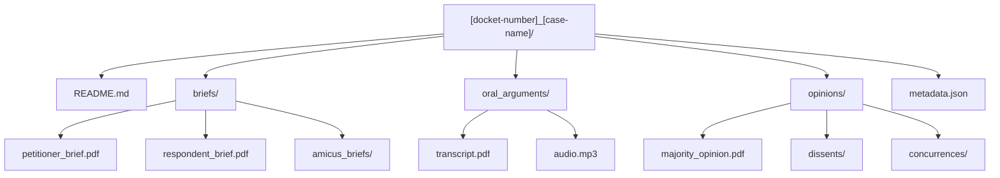

# Supreme Court Data Repository

  

## 📋 Table of Contents

<details>
<summary>Repository Structure</summary>

- [Terms](#terms)
- [Justice Profiles](#justice-profiles)
- [Analysis](#analysis)
- [Case File Structure](#case-file-structure)

</details>

<details>
<summary>Usage & Navigation</summary>

- [Usage](#usage)
- [Data Quality Standards](#data-quality-standards)
- [Contribution Guidelines](#contribution-guidelines)

</details>

## Repository Structure

### Terms

| Term | Years | Status | Key Features |
|------|-------|--------|-------------|
| [2022-2023](terms/2022-2023/) | Jackson's first term | ✅ Complete | Constitutional cases, affirmative action |
| [2023-2024](terms/2023-2024/) | Completed term | 🟡 In Progress | Regulatory decisions, business law |
| [2024-2025](terms/2024-2025/) | Current term | 🔄 Active | Ongoing cases, prediction targets |

### Justice Profiles

<details>
<summary>Conservative Justices</summary>

| Justice | Position | Tenure | Profile |
|---------|----------|--------|---------|
| [Roberts](justices/roberts.md) | Chief Justice | 2005-present | Judicial restraint, institutionalist |
| [Thomas](justices/thomas.md) | Senior Associate | 1991-present | Originalist, conservative anchor |
| [Alito](justices/alito.md) | Associate | 2006-present | Conservative, prosecutorial background |
| [Gorsuch](justices/gorsuch.md) | Associate | 2017-present | Textualist, libertarian leanings |
| [Kavanaugh](justices/kavanaugh.md) | Associate | 2018-present | Conservative, institutionalist |
| [Barrett](justices/barrett.md) | Associate | 2020-present | Originalist, conservative |

</details>

<details>
<summary>Liberal Justices</summary>

| Justice | Position | Tenure | Profile |
|---------|----------|--------|---------|
| [Sotomayor](justices/sotomayor.md) | Associate | 2009-present | Liberal, empathy-focused |
| [Kagan](justices/kagan.md) | Associate | 2010-present | Pragmatic liberal, strategic |
| [Jackson](justices/jackson.md) | Associate | 2022-present | Liberal, criminal justice focus |

</details>

### Analysis

| Directory | Purpose | Status | Contents |
|-----------|---------|--------|-----------|
| [Predictions](analysis/predictions/) | Current predictions | 🟡 Active | Case outcome forecasts |
| [Accuracy](analysis/accuracy_tracking/) | Performance metrics | 📊 Tracking | Historical accuracy data |

## Case File Structure

### Standard Directory Layout



### File Structure Details

| Component | Description | Required | Format |
|-----------|-------------|----------|--------|
| **README.md** | Case summary and outcome | ✅ Yes | Markdown |
| **briefs/** | Legal briefs directory | ✅ Yes | Directory |
| └ petitioner_brief.pdf | Main petitioner argument | ✅ Yes | PDF |
| └ respondent_brief.pdf | Main respondent argument | ✅ Yes | PDF |
| └ amicus_briefs/ | Friend of court briefs | 🟡 Optional | Directory |
| **oral_arguments/** | Argument materials | ✅ Yes | Directory |
| └ transcript.pdf | Official transcript | ✅ Yes | PDF |
| └ audio.mp3 | Argument audio | 🟡 Optional | MP3 |
| **opinions/** | Court decisions | ✅ Yes | Directory |
| └ majority_opinion.pdf | Main court opinion | ✅ Yes | PDF |
| └ dissents/ | Dissenting opinions | 🟡 If applicable | Directory |
| └ concurrences/ | Concurring opinions | 🟡 If applicable | Directory |
| **metadata.json** | Structured case data | ✅ Yes | JSON |

## Usage

### Quick Access Guide

| Need | Path | Description |
|------|------|-------------|
| **Case Predictions** | `[term]/cases/[case]/README.md` | Individual case analysis and outcomes |
| **Justice Analysis** | `/justices/[name].md` | Individual justice behavioral patterns |
| **Term Overview** | `/terms/[year]/term_summary.md` | Complete term analysis |
| **Prediction Data** | `/analysis/predictions/` | Current forecasting data |
| **Accuracy Metrics** | `/analysis/accuracy_tracking/` | Historical performance |

### Navigation Examples

```bash
# Find specific case
data/terms/2022-2023/cases/21-707_students-for-fair-admissions-v-harvard/

# Justice voting patterns
data/justices/roberts.md

# Term predictions
data/analysis/predictions/2024-2025_term_predictions.md
```

## Data Quality Standards

### Completeness Requirements

- [ ] **All major cases documented** per term
- [ ] **Complete file structure** for each case
- [ ] **Metadata accuracy** verified
- [ ] **Cross-references validated** between files
- [ ] **Justice profiles updated** with recent decisions

### Quality Assurance Checklist

- [ ] **File naming convention** followed consistently
- [ ] **README.md completeness** for all cases
- [ ] **Metadata.json validity** (valid JSON, required fields)
- [ ] **PDF accessibility** (all documents readable)
- [ ] **Cross-reference accuracy** (links work correctly)

## Contribution Guidelines

### Adding New Cases

1. **Create case directory** using standard naming convention
2. **Follow file structure** template exactly
3. **Complete metadata.json** with all required fields
4. **Write comprehensive README.md** with analysis
5. **Validate all links** and cross-references

### Updating Justice Profiles

1. **Review recent decisions** for behavioral patterns
2. **Update voting statistics** with new cases
3. **Analyze opinion writing** patterns
4. **Cross-reference** with case outcomes
5. **Validate prediction relevance** for forecasting

> **🎯 Data Quality Goal**  
> Maintain 95%+ accuracy in case metadata and 100% completion rate for major constitutional cases to support 80% SCOTUS prediction accuracy target.