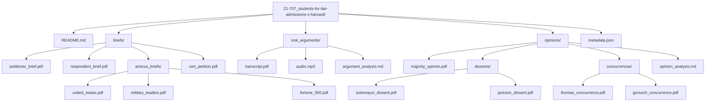

# Sample Case Structure - Students for Fair Admissions v. Harvard

  

**This is an example of how each case folder should be organized**

## 📋 Table of Contents

<details>
<summary>Structure & Organization</summary>

- [Directory Structure](#directory-structure)
- [Case README.md Content Template](#case-readmemd-content-template)
- [Metadata.json Template](#metadatajson-template)

</details>

<details>
<summary>Standards & Guidelines</summary>

- [File Naming](#file-naming)
- [Quality Standards](#quality-standards)

</details>

## Directory Structure

### Visual Structure



### File Structure Table

| Directory/File | Purpose | Required | Notes |
|----------------|---------|----------|-------|
| **README.md** | Case overview and analysis | ✅ Yes | Primary case documentation |
| **briefs/** | Legal arguments directory | ✅ Yes | Core legal materials |
| └ petitioner_brief.pdf | Students for Fair Admissions brief | ✅ Yes | Primary petitioner argument |
| └ respondent_brief.pdf | Harvard University brief | ✅ Yes | Primary respondent argument |
| └ amicus_briefs/ | Friend of court briefs | 🟡 Optional | Third-party perspectives |
|   └ united_states.pdf | US Government amicus | 🟡 Optional | Government position |
|   └ military_leaders.pdf | Veterans/Military amicus | 🟡 Optional | Military perspective |
|   └ fortune_500.pdf | Business community amicus | 🟡 Optional | Business interests |
| └ cert_petition.pdf | Certiorari petition | 🟡 Optional | Original appeal request |
| **oral_arguments/** | Argument materials | ✅ Yes | Court proceeding records |
| └ transcript.pdf | Official argument transcript | ✅ Yes | Complete oral argument |
| └ audio.mp3 | Oral argument audio | 🟡 Optional | Audio recording |
| └ argument_analysis.md | Key moments analysis | 🟡 Optional | Justice questioning patterns |
| **opinions/** | Court decisions | ✅ Yes | Final court rulings |
| └ majority_opinion.pdf | Chief Justice Roberts majority | ✅ Yes | Primary court decision |
| └ dissents/ | Dissenting opinions | 🟡 If applicable | Minority opinions |
|   └ sotomayor_dissent.pdf | Justice Sotomayor dissent | 🟡 If applicable | Individual dissent |
|   └ jackson_dissent.pdf | Justice Jackson dissent | 🟡 If applicable | Individual dissent |
| └ concurrences/ | Concurring opinions | 🟡 If applicable | Agreeing but separate reasoning |
|   └ thomas_concurrence.pdf | Justice Thomas concurrence | 🟡 If applicable | Individual concurrence |
|   └ gorsuch_concurrence.pdf | Justice Gorsuch concurrence | 🟡 If applicable | Individual concurrence |
| └ opinion_analysis.md | Vote breakdown analysis | 🟡 Optional | Reasoning analysis |
| **metadata.json** | Structured case data | ✅ Yes | Machine-readable metadata |

## Case README.md Content Template

```markdown
# Students for Fair Admissions v. Harvard (2023)

**Docket Number**: 21-707  
**Decision Date**: June 29, 2023  
**Vote**: 6-3 (Conservative majority)

## Case Summary
Supreme Court ruled that Harvard's race-conscious admissions program violates Equal Protection Clause, effectively ending affirmative action in higher education.

## ClaudeScotus Analysis
**Prediction Difficulty**: Medium  
**Conservative Coalition Strength**: High (6-3 split predictable)  
**Business Impact**: Broad - affects all higher education institutions

## Vote Breakdown
**Majority (6)**: Roberts (author), Thomas, Alito, Gorsuch, Kavanaugh, Barrett  
**Dissent (3)**: Sotomayor, Kagan, Jackson

## Key Legal Questions
1. Whether Harvard's race-conscious admissions program violates Equal Protection
2. Scope of diversity as compelling government interest
3. Future of race-conscious government programs

## Broader Implications
- Ends decades of affirmative action precedent
- Signals conservative approach to civil rights law
- Creates new framework for equal protection analysis

## Amateur Guide
**What Happened**: Supreme Court banned colleges from considering race in admissions  
**Why It Matters**: Changes how universities select students nationwide  
**Real Impact**: Likely to reduce minority enrollment at selective colleges
```

## Metadata.json Template

```json
{
  "docket_number": "21-707",
  "case_name": "Students for Fair Admissions v. Harvard",
  "short_name": "SFFA v. Harvard",
  "decision_date": "2023-06-29",
  "term": "2022-2023",
  "vote_breakdown": {
    "majority": ["Roberts", "Thomas", "Alito", "Gorsuch", "Kavanaugh", "Barrett"],
    "dissent": ["Sotomayor", "Kagan", "Jackson"],
    "vote_count": "6-3"
  },
  "opinion_authors": {
    "majority": "Roberts",
    "dissents": ["Sotomayor", "Jackson"],
    "concurrences": ["Thomas", "Gorsuch"]
  },
  "legal_areas": [
    "Constitutional Law",
    "Equal Protection",
    "Education Law",
    "Civil Rights"
  ],
  "case_type": "Constitutional Challenge",
  "lower_court": "First Circuit Court of Appeals",
  "lower_court_outcome": "Affirmed Harvard program",
  "supreme_court_outcome": "Reversed",
  "business_impact": "Broad regulatory changes affecting all higher education",
  "prediction_metrics": {
    "difficulty": "Medium",
    "coalition_strength": "High",
    "prediction_value": "High"
  }
}
```

## File Naming

### Naming Convention Standards

| File Type | Convention | Example | Purpose |
|-----------|------------|---------|----------|
| **Cases** | `[docket-number]_[case-name-hyphenated]` | `21-707_students-for-fair-admissions-v-harvard` | Unique identification |
| **PDFs** | Descriptive names | `petitioner_brief.pdf`, `majority_opinion.pdf` | Content identification |
| **Justice Files** | `[lastname]_[opinion-type].pdf` | `sotomayor_dissent.pdf` | Author and type clarity |
| **Analysis** | `.md` format | `argument_analysis.md` | Human-readable format |

### Naming Requirements

- [ ] **Consistent hyphenation** in case names
- [ ] **Clear descriptive names** for all PDFs
- [ ] **Justice surname only** in opinion files
- [ ] **Lowercase with hyphens** for analysis files
- [ ] **No spaces or special characters** in any filenames

## Quality Standards

### Organization Standards

| Standard | Description | Validation Method |
|----------|-------------|-------------------|
| **Clear organization** | Logical directory structure | Manual review |
| **Complete documents** | All required files present | Checklist validation |
| **Analysis-ready structure** | Supports prediction workflow | Usability testing |
| **Consistent navigation** | Uniform across all cases | Cross-case comparison |

### Quality Assurance Checklist

- [ ] **Directory structure** matches template exactly
- [ ] **All required files** present and accessible
- [ ] **File naming conventions** followed consistently
- [ ] **README.md completeness** with all required sections
- [ ] **Metadata.json validity** (valid JSON syntax)
- [ ] **Cross-references work** (all links functional)
- [ ] **Analysis sections complete** with prediction relevance
- [ ] **Justice information accurate** (names, positions, votes)

### Success Criteria

- **95% structural compliance** across all cases
- **100% metadata accuracy** for prediction-critical fields
- **Zero broken links** in navigation and cross-references
- **Complete documentation** for all major constitutional cases

**This structure will be replicated for every major case across all three terms (2022-2024), providing the foundation for ClaudeScotus prediction accuracy validation.**